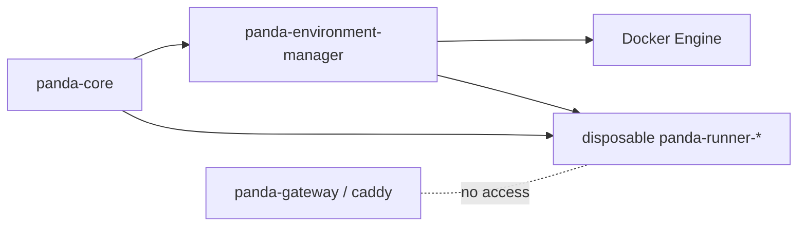

# Disposable Execution Environments

Disposable execution environments are throwaway bash runners that Panda can
create for scoped work. Use them when you want parallel shell work without
sharing the main agent runner's cwd, shell env, or mounted agent home.

They are not a new brain. They are an execution boundary for a session.

## What You Get

- on-demand `panda-runner` containers
- no `/root/.panda`, agent home, or Codex home mount by default
- per-environment shell cwd/env state
- credential allowlist by default, empty unless explicitly granted
- skill allowlist by default, empty unless explicitly granted
- private Docker networks managed by `scripts/docker-stack.sh`

Normal `main` and `branch` sessions still fall back to the persistent per-agent
runner. Worker sessions use their own disposable environment by default.

## When To Use It

Use disposable environments for:

- worker sessions
- risky shell tasks
- parallel bash work
- repo or tool experiments that should not touch the main runner state
- anything that should not touch the main runner's shell state

Use the persistent agent runner for normal long-lived agent work where keeping
cwd, exported env, and agent home access is the point.

## Production Shape



`panda-core` talks to the environment manager over HTTP. The manager owns Docker
Engine access. Disposable runners live on the private disposable runner network.
Gateway and Caddy should not be attached to that network.

Do not mount the Docker socket into `panda-core`.

## Minimal Env

For `scripts/docker-stack.sh`, this is the minimal production setup:

```bash
BASH_EXECUTION_MODE=remote

PANDA_DISPOSABLE_ENVIRONMENTS_ENABLED=true
PANDA_EXECUTION_ENVIRONMENT_MANAGER_TOKEN=<long-random-secret>

PANDA_DISPOSABLE_RUNNER_IMAGE=panda-runner:latest
PANDA_DISPOSABLE_RUNNER_CWD=/workspace
PANDA_ENVIRONMENTS_HOST_ROOT=$HOME/.panda/environments
PANDA_ENVIRONMENTS_ROOT=/root/.panda/environments
PANDA_RUNNER_ENVIRONMENTS_ROOT=/environments
PANDA_DISPOSABLE_CREATE_TIMEOUT_MS=300000
```

`scripts/docker-stack.sh` fills these when they are not set:

```bash
PANDA_EXECUTION_ENVIRONMENT_MANAGER_URL=http://panda-environment-manager:8095
PANDA_EXECUTION_ENVIRONMENT_MANAGER_NETWORK=<project>_execution_manager_net
PANDA_DISPOSABLE_RUNNER_NETWORK=<project>_disposable_runner_net
```

Set the network names yourself only when you need stable names across compose
projects.

## Start It

```bash
./scripts/docker-stack.sh up --build
./scripts/docker-stack.sh ps
./scripts/docker-stack.sh logs environment-manager
```

The stack should include:

- `panda-core`
- `panda-environment-manager`
- the normal persistent `panda-runner-<agent>` services
- disposable runner containers only after a worker/disposable environment is
  created

## Verify Isolation

Check the generated Docker networks:

```bash
docker network inspect <project>_execution_manager_net
docker network inspect <project>_disposable_runner_net
docker network inspect <project>_gateway_edge_net
```

Expected:

- `panda-core` can reach `panda-environment-manager`
- `panda-core` can reach disposable runners
- `panda-environment-manager` can create disposable runners
- `panda-gateway` and `caddy` are not on the disposable runner network
- disposable runners are not on the gateway edge network

Check mounts on a live disposable runner:

```bash
docker inspect <disposable-runner-container> \
  --format '{{json .Mounts}}'
```

Expected:

- no `/root/.panda` mount
- no Codex home mount
- no Docker socket mount
- writable `/workspace`, `/inbox`, and `/artifacts` mounts scoped to that one
  worker

## File Sharing

Each disposable worker gets an agent-scoped filesystem root:

```text
${PANDA_ENVIRONMENTS_HOST_ROOT:-$HOME/.panda/environments}/<agentKey>/<envDir>/
  workspace/
  inbox/
  artifacts/
```

Inside the worker:

- `/workspace` is normal scratch/work space
- `/inbox` is where the parent can place input files
- `/artifacts` is where the worker should put reviewable outputs

The persistent parent runner for the same agent sees its workers at:

```text
/environments/<envDir>/
```

Other agent runners do not mount this namespace.

## Worker A2A Handoff

The parent agent can create an environment first with `environment_create`, or
let `worker_spawn` create one automatically. A worker is a session/task lane; an
environment is the container/filesystem place where bash runs.

`environment_create` returns the environment id plus parent-visible
`workspace`, `inbox`, and `artifacts` paths. The parent can write files into the
environment before assigning a worker.

`worker_spawn` creates the worker session, attaches it to the selected
environment, and wakes the worker with the handoff task. If `environmentId` is
omitted, `worker_spawn` creates a fresh disposable environment. If the selected
environment is stopped, Panda restarts the same environment/filesystem before
binding the worker.

Useful arguments:

- `task`: required worker brief
- `role`: short label, for example `research`, `qa`, or `ops`
- `context`: extra handoff context
- `environmentId`: optional existing environment to attach to
- `model`: optional override; otherwise `WORKER_MODEL`, then the runtime default
- `credentialAllowlist`: env keys the worker may receive
- `skillAllowlist`: skills the worker may read/use
- `toolAllowlist`: extra tools to grant beyond the default worker tool set
- `allowReadonlyPostgres`: explicitly grants readonly SQL access

Worker thinking defaults to `xhigh`. Disposable environments live for 24 hours
by default. `worker_spawn` does not expose thinking or TTL overrides.

The parent stops a container with `environment_stop({ environmentId })`.
Stopping removes the disposable container but keeps `workspace`, `inbox`, and
`artifacts` on disk for review. Worker sessions remain as history until an
operator purge.

Operators hard-purge old stopped worker environments with:

```bash
panda workers purge --stopped --older-than 7d --dry-run
panda workers purge --stopped --older-than 7d --execute
```

`panda workers purge` is dry-run by default and refuses to run without an
explicit selector such as `--stopped`, `--expired`, `--agent`, `--session-id`,
or `--environment-id`. It deletes the execution environment row, attached
worker sessions, cascaded runtime rows, non-cascading outbound/runtime request
rows, and the worker environment filesystem root. It also handles standalone
environments with no workers. External copied media/artifact files outside the
environment root are reported, not deleted. Active unexpired `ready`
environments require `--force`.

The parent agent context includes a worker-environments section for active
environments, recently stopped environments, attached workers, and
parent-visible file paths.

Worker sessions use a dedicated worker base prompt, not the full Panda prompt.
They use normal `message_agent` A2A. The parent and worker are bound by session
id when the worker is created. Workers cannot spawn workers or manage
environments.

Every worker run receives a `Worker Runtime Context` with the durable facts the
worker needs to operate:

- `role`
- `task`
- `context`
- `parentSessionId`
- exact `message_agent({ sessionId: "..." })` parent target
- worker paths: `/workspace`, `/inbox`, `/artifacts`
- parent-visible root: `/environments/<envDir>`

This is separate from the initial handoff message. It is re-rendered as runtime
context on later worker wakes, so the parent session id and file paths do not
depend on old transcript text staying visible.

Worker messages should include:

- `status: done|blocked|question|progress`
- `summary: ...`
- `artifacts: ...`
- `needs: ...`

When a disposable worker sends a message, Panda includes the sender environment
in the A2A wrapper. The parent sees paths like:

- `/environments/<envDir>/workspace`
- `/environments/<envDir>/inbox`
- `/environments/<envDir>/artifacts`

Use those for review and follow-up files. Use attachments for deliberate file
transfer; use `/inbox` and `/artifacts` for ongoing parent-worker coordination.

## Live Smoke Test

Use this mission as the first end-to-end worker test:

```text
Mission: Write a Python script that downloads JSON from httpbin.org/get and prints the response headers.
```

Expected behavior:

- Panda creates a `runtime.execution_environments` row with kind
  `disposable_container`
- Panda creates a `runtime.session_environment_bindings` row for the worker
  session
- the environment manager creates a disposable runner container
- bash starts in `/workspace`
- the command output includes the httpbin response headers
- the worker environment can be stopped or is swept after its TTL

The important check is that the bash command runs inside the disposable runner,
not inside the persistent per-agent runner. After review, use
`panda workers purge --session-id <workerSessionId> --dry-run` and then
`--execute` when the candidate looks right.

## Policy Defaults

| Environment | Credentials | Skills | Tools | Readonly Postgres |
| --- | --- | --- | --- | --- |
| persistent agent runner | all current agent credentials | all current agent skills | normal main-agent tool set | normal tool policy |
| disposable worker env | allowlist, default empty | allowlist, default empty | worker allowlist | disabled unless explicitly allowed |

Default disposable worker tools:

- `bash`
- `background_job_status`
- `background_job_wait`
- `background_job_cancel`
- `message_agent`
- `current_datetime`
- `view_media`
- `web_fetch`
- `brave_search` when available
- `browser`
- `agent_skill` for allowed skill reads
- `image_generate` when available

Credentials are injected per bash request. Runners do not load credentials from
Postgres, files, or long-lived process env.

The skill allowlist applies to:

- the `agent_skill` tool
- readonly `session.agent_skills` queries

Readonly Postgres in a disposable environment requires both
`toolPolicy.postgresReadonly.allowed=true` and `READONLY_DATABASE_URL`. In
`worker_spawn`, set `allowReadonlyPostgres=true`; listing
`postgres_readonly_query` in `toolAllowlist` without that flag is rejected.

## Troubleshooting

`PANDA_EXECUTION_ENVIRONMENT_MANAGER_TOKEN is required`

Set a long random token whenever disposable environments are enabled. Core and
the manager must use the same value.

`panda-core` cannot reach the manager

Check `PANDA_EXECUTION_ENVIRONMENT_MANAGER_URL` inside `panda-core`. In the
Docker stack it should usually be `http://panda-environment-manager:8095`.

The manager cannot create containers

Check Docker access from the manager container. The manager needs Docker Engine
access; `panda-core` and runners do not.

The disposable runner image is missing

Run `./scripts/docker-stack.sh up --build` so `panda-runner:latest` is built
before the manager tries to create disposable runners.

The runner never becomes healthy

Check:

```bash
./scripts/docker-stack.sh logs environment-manager
docker logs <disposable-runner-container>
```

Core receives a runner URL but cannot connect

The disposable runner is probably on the wrong network. Check
`PANDA_DISPOSABLE_RUNNER_NETWORK` and make sure `panda-core` is attached to that
network.

Gateway or Caddy can see disposable runners

That is a deployment bug. Keep gateway/Caddy only on the public edge network and
keep disposable runners only on the private disposable runner network.

## Hard Rules

- do not expose the environment manager publicly without a token
- do not put DB credentials in runner env
- do not put provider API keys in runner env
- do not mount the Docker socket into `panda-core`
- do not mount the Docker socket into disposable runners
- do not attach disposable runners to the gateway/Caddy network
- do not mount agent home unless you intentionally want to break isolation
